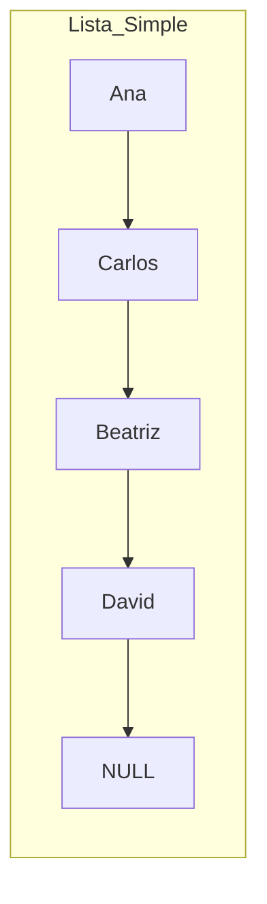
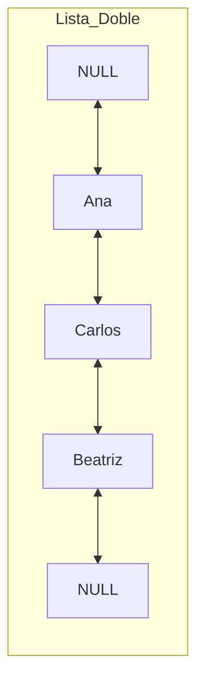
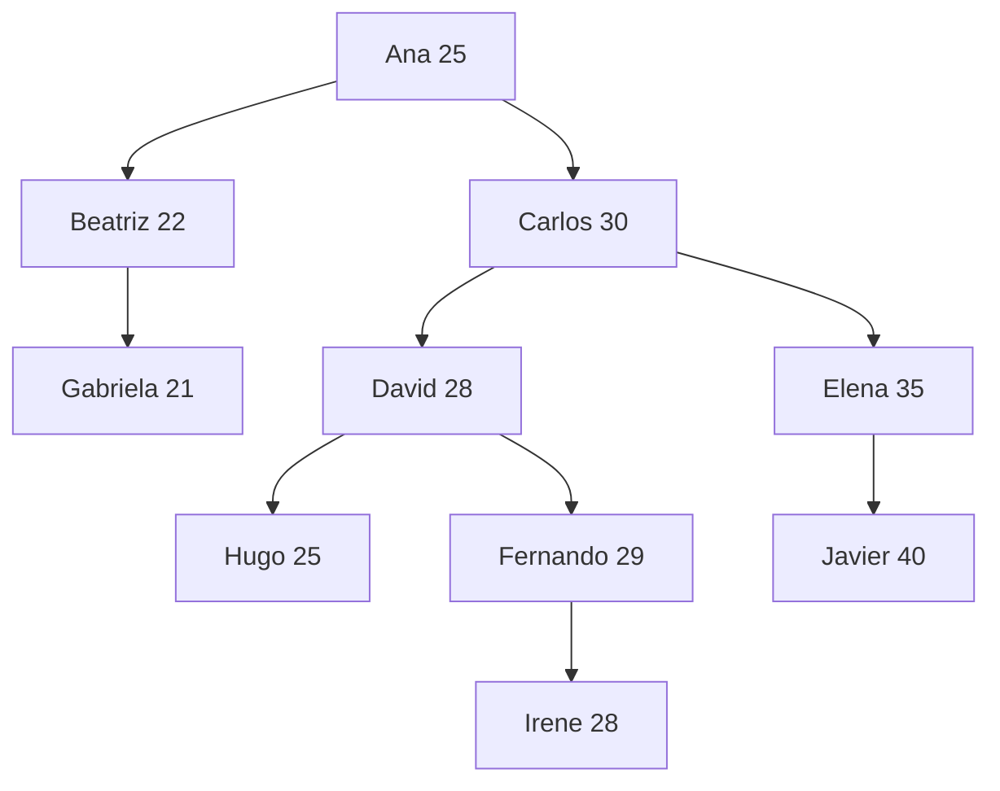
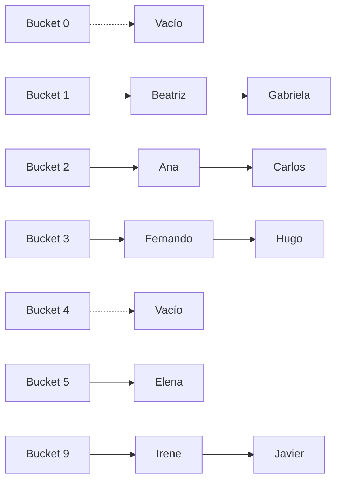
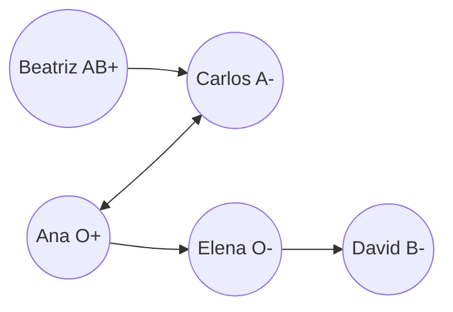

# Manual Técnico y Médico: Estructuras de Datos y Migraciones

> [!NOTE]
> **Contexto del Proyecto**
> Este proyecto modela un sistema de gestión para una **Red de Donantes de Órganos**. Cada paciente es un Nodo de Datos que contiene su Nombre, Edad, Tipo de Sangre, Órgano requerido/donado, y una lista de pacientes médicamente compatibles.

---

## 1. Visualización de las Estructuras de Datos

A continuación, se detalla cómo los pacientes (`Ana`, `Carlos`, `Beatriz`, etc.) se alojan en la memoria RAM dependiendo de la estructura elegida.

### A. Listas Ligadas (Simple y Doble)

Las listas permiten almacenar datos sin un tamaño fijo, alojando los nodos secuencialmente a través de punteros.

* **Uso Hospitalario:** Base de datos cruda de ingreso y navegación bidireccional de expedientes.

### B. Pila (Stack - LIFO) y Cola (Queue - FIFO)

Estructuras lineales con reglas de extracción estrictas.

* **Pila (LIFO):** Último en entrar, primero en salir. Se usa para **auditoría** de los últimos pacientes admitidos.
* **Cola (FIFO):** Primer en entrar, primero en salir. Se usa como **Lista de Espera** de trasplantes.

### C. Árbol Binario de Búsqueda (BST)

Agrupa y rutea nodos basándose en una clave numérica (en nuestro caso, la **EDAD** del paciente). Los menores van a la izquierda, los mayores a la derecha.

* **Uso Hospitalario:** Filtrado ultra-rápido para priorizar pacientes pediátricos (hacia la izquierda del árbol).

### D. Tabla Hash (Mapeo Directo Indexado)

Estructura diseñada para proveer búsquedas de expedientes casi instantáneas ($O(1)$). A diferencia de una Lista donde el sistema debe preguntar "paciente por paciente" hasta encontrar a quien busca, la Tabla Hash te lleva a la dirección de memoria exacta gracias a dos mecanismos programados en nuestro ejemplo:

**1. La Función Hash (Traducción Matemática)**
En el archivo `HashTable.cpp`, utilizamos el **Nombre** del paciente como "Llave" (Key). La función recibe el nombre, extrae el valor numérico de cada letra según la tabla ASCII y los suma. A esta suma acumulada se le aplica una operación **Módulo** basándose en el tamaño de nuestro arreglo.

La ecuación matemática exacta implementada en el sistema es la siguiente:

$$
h(\text{Nombre}) = \left( \sum_{i=1}^{L} \text{ASCII}(\text{Nombre}_{i}) \right) \pmod M
$$

*Donde:*

* $L$ = Longitud total del nombre.
* $\text{Nombre}_i$ = El carácter en la posición $i$ del nombre (ej. 'A', 'n', 'a').
* $M$ = Tamaño total de la tabla en memoria (10 posiciones fijas en este proyecto).

*Ejemplo de cálculo en tiempo real para "Ana":*

1. Suma ASCII: $A (65) + n (110) + a (97) = 272$
2. Módulo (Tamaño 10): $272 \pmod{10} = 2$
3. **Resultado:** Ana se guardará directamente en el cajón de memoria (Bucket) número `2`.

**2. Control de Colisiones (Encadenamiento Secuencial o 'Chaining')**
¿Qué ocurre si analizamos el nombre de *"Carlos"* y, matemáticamente, su módulo resulta ser también un `2`? A esto se le conoce como **Colisión de Memoria**.
Para evitar sobrescribir (y por tanto borrar) el expediente de Ana, el código de nuestra tabla declara sus posiciones no como casillas individuales, sino como un arreglo de Listas Ligadas: `std::list<Person> table[10]`.

* Cuando ocurre la colisión, nuestro sistema usa la estrategia de **Encadenamiento (Chaining)**. Simplemente inserta a Carlos en el cajón `2`, enlazándolo por detrás del nodo que ya estaba ocupado por Ana.
* *Resultado en consola:* `[Bucket 02] -> [Ana] --> [Carlos] --> NULL`
* *Efecto colateral:* Si un *Bucket* sufre demasiadas colisiones, se forma una pequeña lista ligada y la búsqueda dentro de ese cajón específico pasa a costar $O(K)$ en lugar de $O(1)$.

### E. Grafo (Red Médica)

Nodos (Vértices) conectados entre sí a través de enlaces (Aristas). Modela de manera bidireccional o direccional relaciones complejas, actuando como el motor analítico de **Matchmaking (Compatibilidad Cruzada)**.

---

## 2. Análisis de Funciones Base y Complejidad (Big-O)

> [!IMPORTANT]
> Entender el costo computacional dicta qué estructura elegir cuando el hospital tiene 10 pacientes vs 1,000,000 de pacientes.

| Estructura             | Función Base                      | Tiempo (Big-O)        | Espacio (Memoria)           | Lógica Punteros y Mecánica                                      |
| :--------------------- | :--------------------------------- | :-------------------- | :-------------------------- | :---------------------------------------------------------------- |
| **Lista Simple** | `insertar(p)`                    | $O(N)$              | $O(N)$                    | Recorre desde`head` hasta que `temp->next == nullptr`         |
| **Lista Doble**  | `insertar(p)`                    | $O(1)$              | $O(N)$ extra por `prev` | Usa puntero directo`tail->next = newNode` y enlaza el `prev`. |
| **Stack (Pila)** | `push(p)` / `pop()`            | $O(1)$              | $O(N)$                    | `newNode->next = topNode; topNode = newNode;`                   |
| **Queue (Cola)** | `enqueue(p)` / `dequeue()`     | $O(1)$              | $O(N)$                    | `rearNode->next = newNode; rearNode = newNode;`                 |
| **Árbol (BST)** | `insertar(p)` / `buscar(p)`    | Promedio$O(\log N)$ | $O(N)$ + recursividad     | Evalúa recursivamente si`p.edad < node->edad`                  |
| **Hash Table**   | `insertar(p)` / `buscar(p)`    | Promedio$O(1)$      | $O(N)$ + tamaño arreglo  | Extrae índice usando Función Hash y enlaza en la sub-lista.     |
| **Grafo**        | `addPerson()` + `buildEdges()` | $O(V \log V + E)$   | $O(V + E)$                | Diccionarios (`std::map`) indexados y vectores de aristas.      |

---

## 3. Teoría de las Migraciones de Datos

> [!TIP]
> **Definición de Migración:** Proceso de leer los nodos de una estructura original (Origen), extraerlos temporalmente hacia un búfer en la memoria RAM, y re-insertarlos ("vaciar el búfer") en una estructura distinta (Destino).

### Costos Base de la Migración

El costo total de migrar de Origen (A) a Destino (B) depende de cómo interactúan ambas estructuras:

* **Costo de Extracción en A:** Extraer $N$ elementos de Listas, Pilas o Colas toma **$O(N)$**. Extraer de un Árbol mediante un recorrido In-Order también toma **$O(N)$**.
* **Costo de Inserción en B:** Si B es una Pila/Cola ($O(1)$ por inserción), el costo total es $N \times O(1) = O(N)$. Si B es un Árbol (promedio $O(\log N)$), el costo total sube a **$O(N \log N)$**.

### Casos de Uso Reales de Migración en la App

#### 1. Árbol Binario (BST) $\rightarrow$ Cola (Queue)

* **Utilidad Hospitalaria:** El búfer se llena con pacientes ordenados (pediátricos primero). Al insertarlos en una Cola, generamos una **Lista de Espera Pediátrica estrictamente ordenada**.
* **Costo:** $O(N)$ lineal.

#### 2. Cola (Queue) $\rightarrow$ Pila (Stack)

* **Utilidad Hospitalaria:** Al pasar la Lista de Espera a una Pila, el orden cronológico se invierte mágicamente por la ley LIFO. Útil para revisiones y auditorías forenses de las últimas admisiones.
* **Costo:** $O(N)$ lineal.

#### 3. Lista (Secuencial) $\rightarrow$ Grafo (Compatibilidad Cruzada)

* **Utilidad Hospitalaria:** Permite habilitar algoritmos pesados para encontrar "cadenas de donaciones cruzadas cerradas".
* **Costo:** $O(N)$ extraer + $O(N \log N)$ registrar vértices + $O(E \log N)$ trazar aristas.

---

## 4. Resolución de Problemas: Estructuras y Paradigmas Algorítmicos

Las estructuras de datos no existen en el vacío; son las herramientas fundamentales que utilizamos para resolver problemas complejos de la vida real aplicando **Paradigmas de Diseño de Algoritmos**.

Para entender cuándo utilizar cada estructura, a continuación se presenta cómo el sistema hospitalario enfrenta distintos escenarios, qué solución o paradigma computacional se requiere, y cuál es la estructura de datos subyacente que lo hace posible:

| Problema Médico (El Reto)                                                                                                                                                      | Solución Clínica (Cómo lo resolvemos)                                                                                                                    | Paradigma Algorítmico                                                            | Estructura Empleada                         |
| :------------------------------------------------------------------------------------------------------------------------------------------------------------------------------ | :---------------------------------------------------------------------------------------------------------------------------------------------------------- | :-------------------------------------------------------------------------------- | :------------------------------------------ |
| **Auditoría Exhaustiva:** El Ministerio exige revisar todo el historial del hospital buscando un caso anómalo, sin tener ningún índice previo.                        | Revisar secuencialmente expediente por expediente, desde el primero hasta el último, evaluando a absolutamente todos los pacientes de la red.              | **Fuerza Bruta** *(Brute Force)* / Búsqueda Lineal                       | **Listas Ligadas** (Simples o Dobles) |
| **Prioridad Pediátrica Urgente:** Llega un órgano pediátrico. Necesitamos encontrar de inmediato a un paciente infantil en una base de 500,000 adultos y niños.       | Descartar masivamente a los adultos. En cada paso el sistema elimina la mitad de los registros restantes según la edad, llegando al niño en milisegundos. | **Divide y Vencerás** *(Divide & Conquer)* / Búsqueda Binaria           | **Árbol Binario de Búsqueda (BST)** |
| **Cadena de Donantes Rota:** Se programa una cadena de donación de 5 personas. En el paso 4, surgen anticuerpos y el paciente rechaza repentinamente el órgano.         | No empezar desde cero. "Deshacer" (Pop) únicamente el 4to paso, regresar al 3er paciente, e intentar explorar un receptor alternativo desde ese punto.     | **Vuelta Atrás** *(Backtracking)* / Búsqueda en Profundidad (DFS)       | **Pila** *(Stack - LIFO)*           |
| **Búsqueda de Contactos Directos:** Necesitamos ubicar qué pacientes están a solo "1 grado de separación" (compatibles directos inmediatos) de un paciente infectado. | Analizar el contagio por "capas" o "niveles". Atender y evaluar a todos los contactos inmediatos antes de profundizar hacia pacientes más lejanos.         | **Búsqueda en Anchura** *(BFS)* / Exploración por Niveles               | **Cola** *(Queue - FIFO)*           |
| **Saturación del Procesador:** Calcular el *Riesgo de Mortalidad* de un paciente toma 5 min de CPU. Al ser consultado repetidamente, el sistema colapsa.               | Calcular el riesgo de cada paciente una sola vez. Se asocia al nombre y se indexa en memoria RAM para entregarlo instantáneamente a futuro.                | **Memorización** *(Dynamic Programming)* / Sistema de Caché             | **Tabla Hash** *(Mapeo Indexado)*   |
| **Logística de Traslado:** Un helicóptero debe transportar un corazón entre 4 hospitales, pero se debe minimizar el gasto total de combustible y tiempo.               | Trazar el mapa. Seleccionar en cada intersección la ruta más corta o barata de manera iterativa hasta llegar al destino final (Ej. Dijkstra).             | **Algoritmos Ávidos** *(Greedy Algorithms)* / Optimización Combinatoria | **Grafo** *(Vértices y Aristas)*   |
