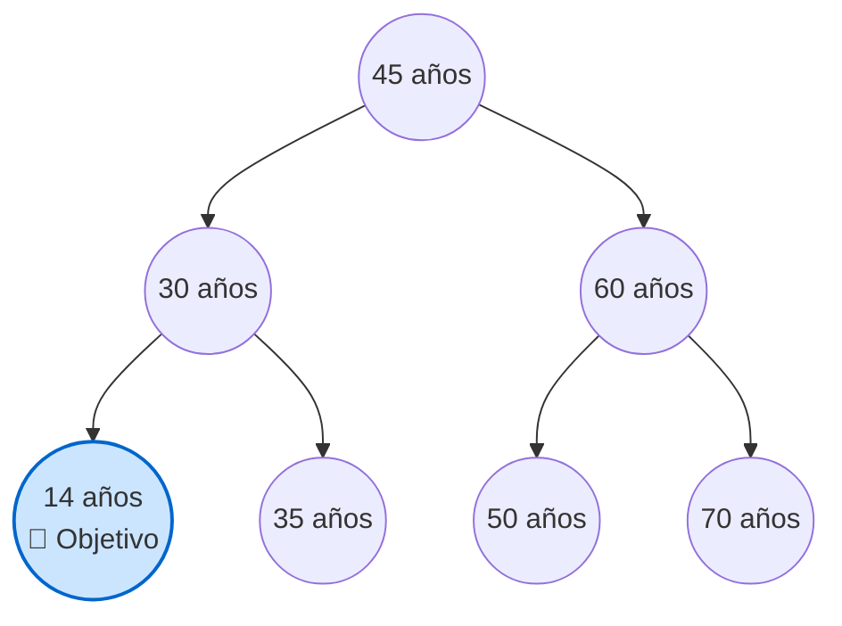
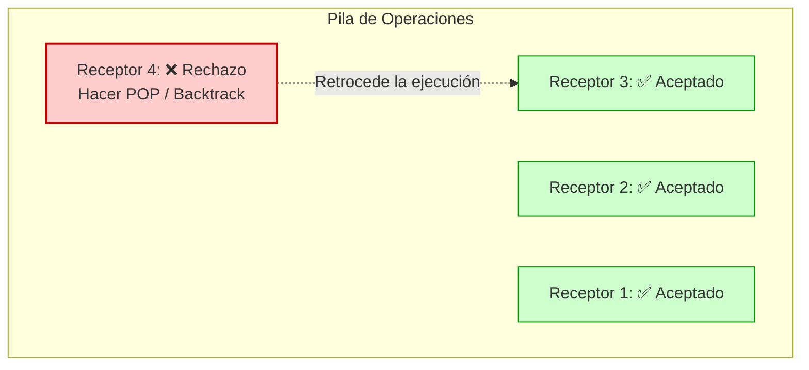
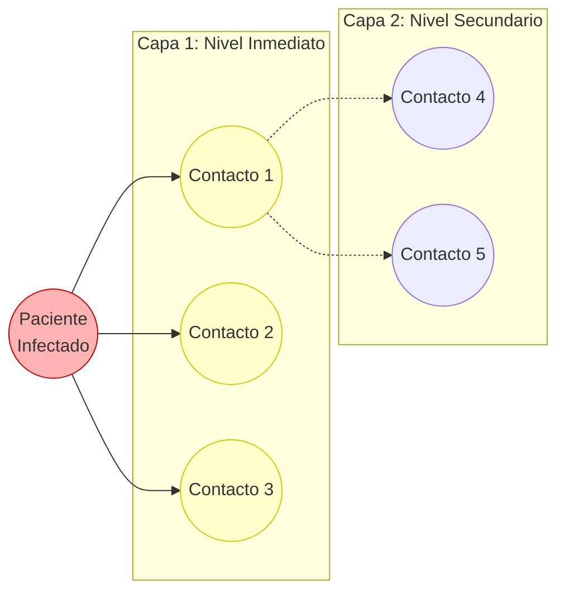
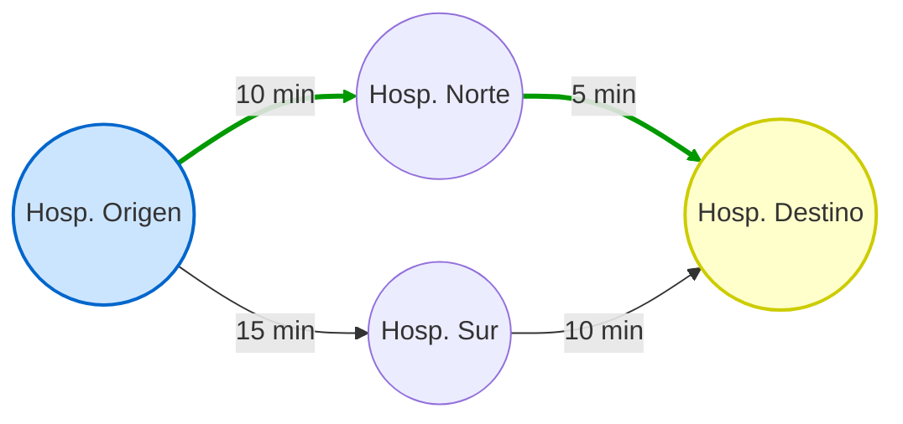

# Soluciones Algorítmicas en el Entorno Hospitalario

Este documento presenta el diseño de pseudocódigos, diagramas conceptuales y la implementación en C/C++ para los diferentes escenarios hospitalarios expuestos, respetando los paradigmas algorítmicos y las estructuras de datos propuestas.

---

## 1. Auditoría Exhaustiva
**Problema:** Revisar todo el historial buscando un caso anómalo sin índice previo.
**Solución:** Búsqueda Lineal / Fuerza Bruta.
**Estructura:** Lista Ligada (Simple o Doble).

### Esquema Visual


### Pseudocódigo
```text
Función BuscarCasoAnomalo(cabeza_lista):
    nodo_actual = cabeza_lista
    Mientras nodo_actual NO sea NULO:
        Si nodo_actual.es_anomalo == VERDADERO:
            Retornar nodo_actual
        nodo_actual = nodo_actual.siguiente
    Retornar NULO (No se encontró)
```

### Implementación en C++
```cpp
#include <iostream>

struct Expediente {
    int id_paciente;
    bool es_anomalo;
    Expediente* siguiente;
};

Expediente* buscarCasoAnomalo(Expediente* cabeza) {
    Expediente* actual = cabeza;
    while (actual != nullptr) {
        if (actual->es_anomalo) {
            return actual; // Se encontró la anomalía
        }
        actual = actual->siguiente;
    }
    return nullptr; // No se encontró
}
```

---

## 2. Prioridad Pediátrica Urgente
**Problema:** Encontrar un paciente infantil (edad < 18) en una base de datos masiva rápidamente.
**Solución:** Divide y Vencerás / Búsqueda Binaria.
**Estructura:** Árbol Binario de Búsqueda (BST) indexado por edad.

### Esquema Visual


### Pseudocódigo
```text
Función BuscarPacientePediatrico(raiz_arbol):
    Si raiz_arbol es NULO:
        Retornar NULO
    
    Si raiz_arbol.edad < 18:
        Retornar raiz_arbol (¡Encontrado!)
    
    // Si la edad es 18 o mayor, buscar en el subárbol izquierdo (menores edades)
    Retornar BuscarPacientePediatrico(raiz_arbol.izquierdo)
```

### Implementación en C++
```cpp
#include <iostream>

struct NodoPaciente {
    int id;
    int edad;
    NodoPaciente* izquierdo;
    NodoPaciente* derecho;
};

NodoPaciente* buscarPacientePediatrico(NodoPaciente* raiz) {
    if (raiz == nullptr) return nullptr;
    
    if (raiz->edad < 18) return raiz; // Objetivo encontrado
    
    // Como es un BST ordenado por edad, los menores están a la izquierda
    return buscarPacientePediatrico(raiz->izquierdo);
}
```

---

## 3. Cadena de Donantes Rota
**Problema:** Un receptor rechaza el órgano en el paso 4; se debe deshacer ese paso e intentar otra vía.
**Solución:** Vuelta Atrás (Backtracking) / DFS.
**Estructura:** Pila (Stack - LIFO).

### Esquema Visual


### Pseudocódigo
```text
Función ArmarCadenaDonacion(candidatos):
    Pila cadena_actual
    
    Para cada candidato en candidatos:
        cadena_actual.push(candidato)
        
        Si EvaluarRechazo(candidato) == VERDADERO:
            cadena_actual.pop() // Retroceder (Backtrack)
        Sino:
            Si cadena_actual.tamaño == 5:
                Retornar "Cadena Exitosa"
                
    Retornar "Fallo en la cadena"
```

### Implementación en C++
```cpp
#include <iostream>
#include <stack>
#include <vector>

struct Paciente {
    int id;
    bool tiene_anticuerpos_rechazo;
};

bool armarCadena(std::vector<Paciente>& candidatos) {
    std::stack<Paciente> cadena;
    
    for (Paciente& p : candidatos) {
        cadena.push(p);
        
        if (p.tiene_anticuerpos_rechazo) {
            std::cout << "Rechazo en paciente " << p.id << ". Backtrack...\n";
            cadena.pop(); // Backtracking
        } else {
            if (cadena.size() == 5) return true; // Éxito
        }
    }
    return false;
}
```

---

## 4. Búsqueda de Contactos Directos
**Problema:** Ubicar a todos los pacientes a "1 grado de separación" antes de profundizar.
**Solución:** Búsqueda en Anchura (BFS).
**Estructura:** Cola (Queue - FIFO).

### Esquema Visual


### Pseudocódigo
```text
Función BuscarContactos(paciente_cero):
    Cola cola_evaluacion
    Conjunto visitados
    
    cola_evaluacion.encolar(paciente_cero)
    visitados.agregar(paciente_cero)
    
    Mientras cola_evaluacion NO esté vacía:
        actual = cola_evaluacion.desencolar()
        Procesar(actual)
        
        Para cada contacto en actual.contactos_directos:
            Si contacto NO está en visitados:
                visitados.agregar(contacto)
                cola_evaluacion.encolar(contacto)
```

### Implementación en C++
```cpp
#include <iostream>
#include <vector>
#include <queue>
#include <unordered_set>

void buscarContactosBFS(int paciente_cero, std::vector<std::vector<int>>& red) {
    std::queue<int> cola;
    std::unordered_set<int> visitados;
    
    cola.push(paciente_cero);
    visitados.insert(paciente_cero);
    
    while (!cola.empty()) {
        int actual = cola.front();
        cola.pop();
        
        std::cout << "Evaluando paciente: " << actual << "\n";
        
        for (int contacto : red[actual]) {
            if (visitados.find(contacto) == visitados.end()) {
                visitados.insert(contacto);
                cola.push(contacto); // Se encola para explorar su capa después
            }
        }
    }
}
```

---

## 5. Saturación del Procesador
**Problema:** Calcular el riesgo de mortalidad toma mucho CPU; consultarlo repetidamente colapsa el sistema.
**Solución:** Memorización (Caché).
**Estructura:** Tabla Hash (Mapeo Indexado).

### Esquema Visual
```mermaid
graph LR
    P[ID Paciente: 1024] --> H{Función Hash}
    
    subgraph Memoria Caché O 1
    H --> T1[ID: 1020 | Riesgo: 12%]
    H --> T2[ID: 1024 | Riesgo: 85.5%]
    H --> T3[ID: 1055 | Riesgo: 40%]
    end
    
    style T2 fill:#ccffcc,stroke:#009900,stroke-width:2px
```

### Pseudocódigo
```text
TablaHash cache_riesgos

Función ObtenerRiesgoMortalidad(id_paciente):
    Si cache_riesgos.contiene(id_paciente):
        Retornar cache_riesgos.obtener(id_paciente) // Instántaneo
        
    riesgo = CalculoPesadoRiesgo(id_paciente) // Demora 5 min
    cache_riesgos.insertar(id_paciente, riesgo)
    
    Retornar riesgo
```

### Implementación en C++
```cpp
#include <iostream>
#include <unordered_map>
#include <thread>
#include <chrono>

std::unordered_map<int, double> cacheRiesgos;

double calculoPesado(int id) {
    std::this_thread::sleep_for(std::chrono::milliseconds(500)); // Simulación
    return 85.5; 
}

double obtenerRiesgoMortalidad(int id_paciente) {
    if (cacheRiesgos.find(id_paciente) != cacheRiesgos.end()) {
        return cacheRiesgos[id_paciente]; // Consulta instantánea
    }
    
    double riesgo = calculoPesado(id_paciente);
    cacheRiesgos[id_paciente] = riesgo; // Memorización
    
    return riesgo;
}
```

---

## 6. Logística de Traslado
**Problema:** Transportar un órgano entre hospitales minimizando costo y tiempo.
**Solución:** Algoritmo Ávido (Dijkstra) / Optimización.
**Estructura:** Grafo (Vértices y Aristas) y Cola de Prioridad.

### Esquema Visual

*En verde se resalta el camino más corto tomado iterativamente (10 min + 5 min).*

### Pseudocódigo
```text
Función DijkstraLogistica(grafo, origen):
    ColaPrioridad min_heap
    Arreglo distancias (infinito)
    
    distancias[origen] = 0
    min_heap.insertar(origen, 0)
    
    Mientras min_heap NO esté vacía:
        hospital_actual = min_heap.extraer_minimo()
        
        Para cada vecino en grafo.vecinos(hospital_actual):
            nuevo_costo = distancias[hospital_actual] + costo(hospital_actual, vecino)
            
            Si nuevo_costo < distancias[vecino]:
                distancias[vecino] = nuevo_costo
                min_heap.insertar(vecino, nuevo_costo)
                
    Retornar distancias
```

### Implementación en C++
```cpp
#include <iostream>
#include <vector>
#include <queue>

using namespace std;
typedef pair<int, int> Arista; 
const int INF = 1e9;

void calcularMejorRuta(int origen, int num_hospitales, vector<vector<Arista>>& grafo) {
    vector<int> distancias(num_hospitales, INF);
    priority_queue<Arista, vector<Arista>, greater<Arista>> min_heap;
    
    distancias[origen] = 0;
    min_heap.push({0, origen});
    
    while (!min_heap.empty()) {
        int costo_actual = min_heap.top().first;
        int u = min_heap.top().second;
        min_heap.pop();
        
        if (costo_actual > distancias[u]) continue;
        
        for (auto& arista : grafo[u]) {
            int v = arista.second;
            int peso = arista.first;
            
            if (distancias[u] + peso < distancias[v]) {
                distancias[v] = distancias[u] + peso;
                min_heap.push({distancias[v], v}); // Se prioriza el de menor costo
            }
        }
    }
}
```
